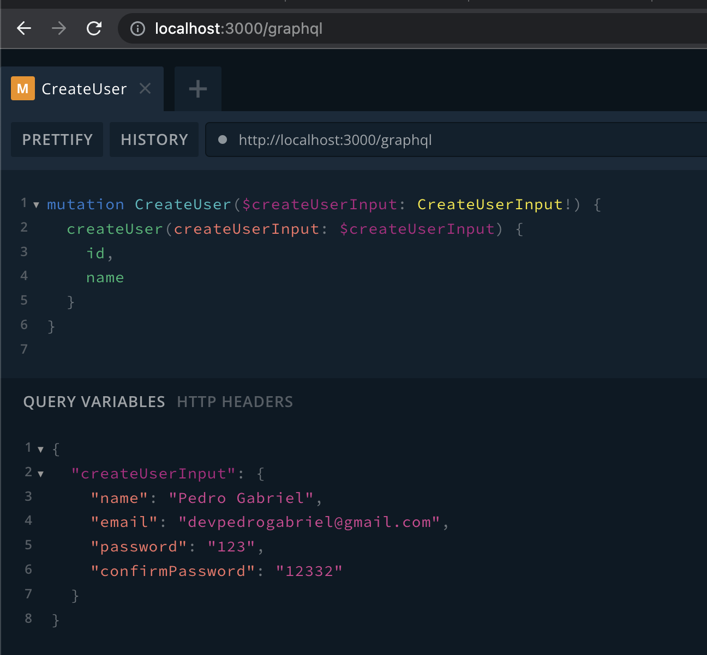

## Pre-requisites

- [ ] I Have Node version > 18
- [ ] I have a mysql server running

## Instalation

- [ ] Run `npm install`
- [ ] Create a file `.env` based in the `.env.example` and put the infos about the mysql server and JWT secret
- [ ] Run `npx kenex migrate:up`
- [ ] Open a new terminal and run `npm run start:dev`
- [ ] Open the browser in `http://localhost:3000/graphql`

## GraphQL Playground examples:



### CreateUser mutation

Body:
```graphql
mutation CreateUser($createUserInput: CreateUserInput!) {
  createUser(createUserInput: $createUserInput) {
    id,
    name
  }
}
```
Query Variables:
```graphql
{
  "createUserInput": {
  	"name": "Pedro Gabriel",
    "email": "somefancyemail@gmail.com",
    "password": "someSecuryPassword(132)@1",
    "confirmPassword": "someSecuryPassword(132)@1"
	}
}
```

### doLogin Mutation

Body:
```graphql
mutation DoLogin($loginUserInput: LoginUserInput!) {
  doLogin(loginUserInput: $loginUserInput) {
    accessToken
  }
}
```
Query Variables:
```graphql
{
  "loginUserInput": {
    "email": "somefancyemail@gmail.com",
    "password": "123"
	}
}
```

Save the `accessToken` in some place to use in the next requests

### updateUser Mutation

Http Headers:
```graphql
{
  "Authorization": "Bearer ...ACCESS_TOKEN..."
}
```
Body:
```graphql
mutation UpdateUser($updateUserInput: UpdateUserInput!) {
  updateUser(updateUserInput: $updateUserInput) {
    id,
    name,
    email
  }
}
```
Query Variables:
```graphql
{
  "updateUserInput": {
    "name": "Pedro Gabriel Rabelo Barboza",
    "newEmail": "anotherfancyemail@gmail.com",
    "confirmNewEmail": "anotherfancyemail@gmail.com"
	}
}
```

### updatePassword Mutation

Http Headers:
```graphql
{
  "Authorization": "Bearer ...ACCESS_TOKEN..."
}
```
Body:
```graphql
mutation UpdateUserPassword($updateUserPasswordInput: UpdateUserPasswordInput!) {
  updateUserPassword(updateUserPasswordInput: $updateUserPasswordInput)
}
```
Query Variables:
```graphql
{
  "updateUserPasswordInput": {
    "oldPassword": "oldSecurePassword*&3131",
    "newPassword": "anotherSecurePassword*&3131",
    "confirmNewPassword": "anotherSecurePassword*&3131"
  }
}
```

### user Query

Http Headers:
```graphql
{
  "Authorization": "Bearer ...ACCESS_TOKEN..."
}
```
Body:
```graphql
query User {
  user {
    id
    email
    name
  }
}
```
